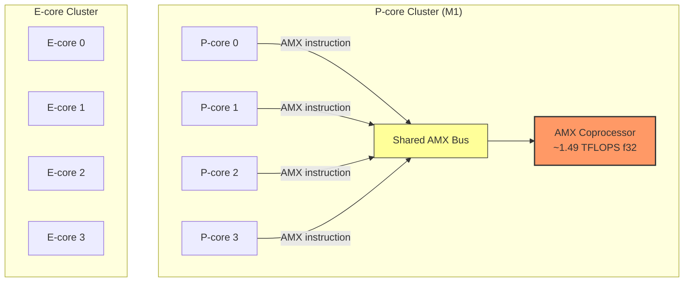
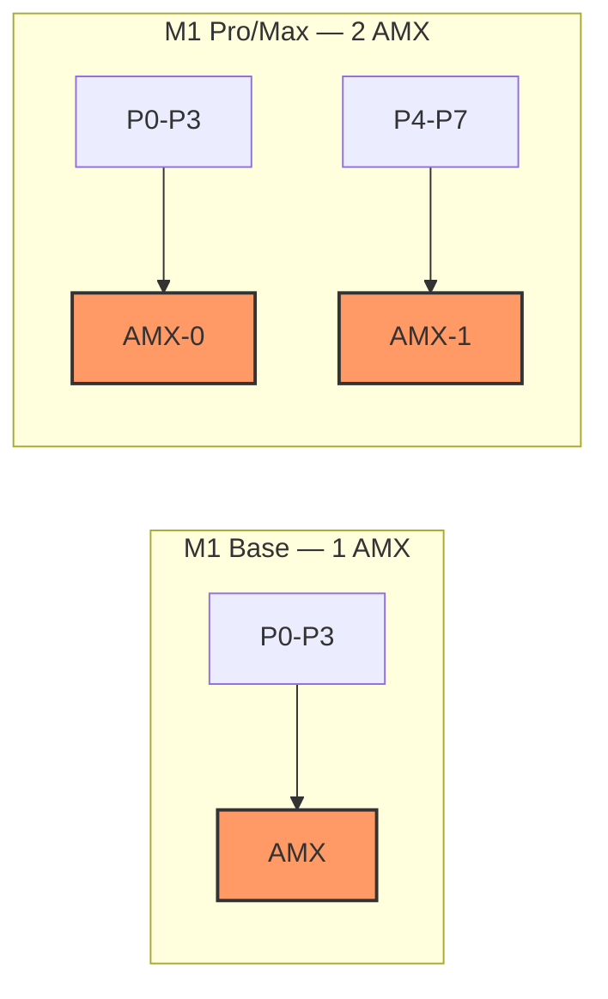

<!-- SPDX-License-Identifier: CC-BY-NC-SA-4.0 -->

# AMX コプロセッサから読み解く 4言語並列学習ベンチマーク

## ベンチマーク結果

同一モデル(MoE Transformer, hidden=64)、同一ハードウェア(M1, 4 P-core)、同一 BLAS(Apple Accelerate `cblas_sgemm`)。言語だけが変数。

### 並列学習 (Parallel Training)

| Language | T1 (trn/s) | T2 (trn/s) | T4 (trn/s) | T4/T1 |
|----------|-----------|-----------|-----------|-------|
| Julia    | 943       | 1,490     | 1,558     | 1.65x |
| Rust     | 758       | 1,170     | 1,309     | 1.73x |
| Go       | 311       | 524       | 867       | 2.79x |
| Python   | 175       | 311       | 503       | 2.88x |

### 並列推論 (Parallel Inference)

| Language | T1 (inf/s) | T2 (inf/s) | T4 (inf/s) | T4/T1 |
|----------|-----------|-----------|-----------|-------|
| Rust     | 1,742     | 3,118     | 4,732     | 2.72x |
| Julia    | 1,469     | 2,800     | 4,226     | 2.88x |
| Go       | 897       | 1,516     | 2,189     | 2.44x |
| Python   | 678       | 1,277     | 1,859     | 2.74x |

2つのテーブルを見比べてほしい。**推論の T4/T1 が 2.4--2.9x なのに、学習の T4/T1 は Julia 1.65x、Rust 1.73x しか出ていない。** Go/Python は逆に 2.8x 近い。この非対称性の原因は、Apple Silicon の AMX アーキテクチャにある。

---

## AMX アーキテクチャ -- P-core クラスター共有バス

Apple Silicon の行列演算は CPU コアが自力で行うのではない。**AMX (Apple Matrix eXtensions)** と呼ばれる専用コプロセッサが P-core クラスター内に1基だけ存在し、4つの P-core がバスを共有してアクセスする[^1][^2]。



Eclectic Light Company の解析によれば:

> "instructions are packed into a single bus transaction and transferred from the source core to the target AMX unit... the bus is a shared resource" [^2]

ポイントは3つ:

1. **AMX は P-core クラスターに1基のみ。** M1 の P-core は4つあるが、行列演算ユニットは1つしかない
2. **共有バスでシリアライズされる。** 複数コアが同時に `cblas_sgemm` を発行すると、バスレベルでキューイングが発生する
3. **E-core には AMX がない。** 並列度を上げても E-core 側に overflow しない -- AMX は P-core クラスター専用

philipturner/amx-benchmarks の測定では、T1 → T2 → T2+ で最大 2.67x のスケーリングにとどまり、SGEMM/DGEMM では「calling into Accelerate from multiple threads wrecked performance」と報告されている[^3]。

---

## なぜ Training のスケーリングは Inference より悪いのか

ここが本題。推論と学習の AMX バス占有量の違いを定量的に考える。

### Forward pass の AMX バストランザクション

推論(forward pass)では、各 Transformer Block で以下の BLAS 呼び出しが発生する:

- $Q = X \cdot W_Q$, $K = X \cdot W_K$, $V = X \cdot W_V$ (3回)
- $\text{Attn} = Q \cdot K^T$ (1回)
- $\text{Context} = \text{Attn} \cdot V$ (1回)
- $O = \text{Context} \cdot W_O$ (1回)
- MoE: expert FFN の gate/up/down (top-k=2 experts x 3 = 6回)

1ブロックあたり約 **12 回**の `cblas_sgemm` 呼び出し。2ブロックで **24回**。

### Backward pass の追加バストランザクション

学習では forward に加えて backward pass が走る。各 BLAS 呼び出しに対して:

$$\frac{\partial L}{\partial W} = X^T \cdot \frac{\partial L}{\partial Y}, \quad \frac{\partial L}{\partial X} = \frac{\partial L}{\partial Y} \cdot W^T$$

つまり **forward の各 sgemm に対して、backward で最低2回の sgemm が追加される**。実際にはさらに attention の backward($dQ$, $dK$, $dV$ の計算)で追加の matmul が入る。

概算:

| Pass | BLAS calls/step | AMX bus transactions |
|------|----------------|---------------------|
| Forward only | ~24 | ~24 |
| Forward + Backward | ~24 + ~48 = ~72 | ~72 |
| + Optimizer (AdamW) | +0 (element-wise) | ~72 |

**学習は推論の約3倍の AMX バストランザクションを生成する。**

AdamW のモーメント更新は element-wise 演算(AMX を使わない NEON/スカラー演算)なので、AMX バス負荷には寄与しない。しかし backward の matmul は全て AMX を経由する。

### Amdahl's Law で考える

AMX バスを共有リソースとしてモデル化する。1つの training step の実行時間を:

$$T_{\text{total}} = T_{\text{AMX}} + T_{\text{non-AMX}}$$

$T_{\text{AMX}}$ = AMX コプロセッサでの matmul 時間(シリアル)、$T_{\text{non-AMX}}$ = softmax、RMSNorm、MoE routing、AdamW など(並列可能)。

$N$ スレッドで並列化したとき、AMX 部分は共有リソースなのでスケールしない:

$$T_{\text{parallel}}(N) = T_{\text{AMX}} + \frac{T_{\text{non-AMX}}}{N}$$

スピードアップは:

$$S(N) = \frac{T_{\text{total}}}{T_{\text{parallel}}(N)} = \frac{1}{f + \frac{1 - f}{N}}$$

ここで $f = T_{\text{AMX}} / T_{\text{total}}$ は AMX 占有率。

**推論の場合**: hidden=64 では non-BLAS 比率が高い(FFI dispatch overhead、softmax、RMSNorm がそれぞれ数 us)。$f \approx 0.3$--$0.4$ 程度と推定。

$$S(4) = \frac{1}{0.35 + 0.65/4} = \frac{1}{0.35 + 0.163} = 1.95\text{x}$$

実測は 2.4--2.9x。AMX のパイプライン並列性(コアが交互にバスを使う)を考慮すると妥当。

**学習の場合**: backward pass で matmul が3倍になるので AMX 占有率が上がる。$f \approx 0.5$--$0.6$。

$$S(4) = \frac{1}{0.55 + 0.45/4} = \frac{1}{0.55 + 0.113} = 1.51\text{x}$$

Julia の実測 1.65x、Rust の 1.73x と整合する。

arXiv:2406.19621 (2024) はまさにこの問題を分析している: **「スレッド同期がランタイムの 30--50% を消費する」** -- 小行列の SGEMM で 64x2048x64 が 5スレッドで 96スレッドの 2.8倍高速だったという結果は、共有リソースへのコンテンションがスレッド数に対して急激に悪化することを示す[^4]。

---

## なぜ Julia > Rust (Training) なのか

### Julia: broadcast fusion による backward 最適化

Julia の学習速度優位(T1: 943 trn/s vs Rust 758 trn/s)は、backward pass の実装差に起因する。

Julia 1.12 の `@simd` は **ループ1回あたり 9K--11K のヒープアロケーション** を生成する(SIMD lane metadata)[^7]。これを `@.` broadcast fusion に置き換えると:

```
# Before: @simd → 9K-11K alloc/loop
@inbounds @simd for i in eachindex(grad)
    grad[i] = grad[i] * mask[i]
end

# After: @. broadcast → 0 alloc
@. grad = grad * mask
```

Julia の broadcast fusion は **言語レベルの融合コンパイル能力** である。コンパイラが element-wise 演算を単一ループに融合し、中間配列を一切生成しない[^7]。これは CPU 固有のトリックではなく、GPU では [Reactant.jl](https://github.com/EnzymeAD/Reactant.jl)（XLA backend）として発現し、計算グラフ全体の自動カーネル融合を実現する。Rust には同等の自動融合機構がなく、GPU で同じ効果を得るには手動 CUDA カーネルか Burn 等のフレームワークが必要になる。結果:

| Metric | Before (@simd) | After (@. broadcast) | Change |
|--------|---------------|---------------------|--------|
| train alloc | 55.5M/step | 3.0M/step | -94% (7.2x) |
| train time | 7.36ms | 0.99ms | -87% (7.4x) |
| fwd:bwd ratio | 12:1 | 1.7:1 | -- |

### Rust: manual AD のヒープ書き込みコスト

一方 Rust の backward pass は手書きの逆伝播。ad-trait 論文 (arXiv:2504.15976, 2025) が指摘する通り:

> "every primitive operation in reverse-mode AD requires a heap memory write, which remains significantly slower than performing the raw computation" [^6]

Rust の backward は各パラメータの勾配をヒープ上のバッファに書き込む。ゼロアロケーション設計(train alloc 1.4M/step)ではあるが、**broadcast fusion のような演算融合がないため、element-wise 演算ごとに個別のループが走る**。

これは markaicode (2025) の比較とも一致する: MNIST training で Julia 42s vs Rust 45s (Julia 7% 高速)、行列乗算では Rust 42ms vs Julia 45ms (Rust 7% 高速)[^5]。学習では Julia、純粋な行列演算では Rust -- 同じパターンがこのベンチマークでも再現されている。

### 逆に Inference では Rust > Julia

推論では backward pass がない。AMX バストランザクションは forward の ~24回のみ。ここで効くのは:

- **non-BLAS カーネル速度**: Rust の softmax 1.81us vs Julia 4.83us (2.7x)、rmsnorm 3.38us vs 4.33us (1.3x)。Rust の LLVM AOT はスカラーループで Julia の JIT を上回る
- **メモリフットプリント**: Rust 19.8MB vs Julia 488MB。L2 cache (M1: 12MB) に対するフットプリント差がキャッシュ効率に影響する可能性がある
- **FFI dispatch**: Rust の直接 `extern "C"` vs Julia の LBT (libblastrampoline) 経由。sub-microsecond だが 24回/step 積算される

結果として T4 推論: Rust 4,732 inf/s vs Julia 4,226 inf/s (Rust 12% 優位)。

---

## なぜ Go/Python のスケーリング比は高いのか

学習の T4/T1 が Go 2.79x、Python 2.88x と、Julia (1.65x) / Rust (1.73x) より高い。一見矛盾するが、Amdahl's Law で説明できる。

### BLAS 利用率の差

Go と Python は non-BLAS 演算が遅い:

| Language | softmax (us) | rmsnorm (us) | Interpreter/runtime overhead |
|----------|-------------|-------------|------------------------------|
| Rust     | 1.81        | 3.38        | None |
| Julia    | 4.83        | 4.33        | JIT compiled |
| Go       | 5.65        | 8.60        | No SIMD, no LLVM |
| Python   | 14.92       | 22.60       | CPython interpreter |

Go/Python の training step における AMX 占有率 $f$ は **低い**。なぜなら non-BLAS 部分(softmax、rmsnorm、AdamW、MoE routing)が全体の大きな割合を占めるから。

$$f_{\text{Go}} \approx 0.25, \quad f_{\text{Python}} \approx 0.15$$

$$S_{\text{Go}}(4) = \frac{1}{0.25 + 0.75/4} = 2.13\text{x}$$

$$S_{\text{Python}}(4) = \frac{1}{0.15 + 0.85/4} = 2.76\text{x}$$

**non-BLAS 部分が遅いほど、並列化可能な割合が増える。** Python の CPython interpreter overhead は "遅い" が、それは AMX を使わない演算なので、スレッド間で完全に並列化できる。結果として T4/T1 のスケーリング比は高くなる。

これは直感に反するが数学的に正しい。**遅い言語ほどスケーリング比が良い** -- ただし **絶対性能は低いまま**。T4 での絶対スループットは Julia 1,558 trn/s、Python 503 trn/s。3.1倍の差。

`VECLIB_MAXIMUM_THREADS` による Accelerate 内部スレッド制御は ARM では効果がない -- Apple の GCD (Grand Central Dispatch) が内部的にスレッド管理を行うため。

---

## 考察

### 現実の data-parallel training への示唆

このベンチマークは **1チップ内の thread-level parallelism** を測定している。現実の分散学習は data parallelism (バッチ分割) + model parallelism (レイヤー分割) で、通信ボトルネック (AllReduce) が支配的。

しかし AMX アーキテクチャの教訓は GPU にも適用できる:

1. **共有リソースの contention は非線形に悪化する。** AMX バスでの結果は、GPU の SM (Streaming Multiprocessor) 間での shared memory / L2 cache contention と本質的に同じ構造

2. **Backward pass は forward の3倍のバス帯域を要求する。** これは GPU でも同じ。A100 の HBM2e 帯域 (2TB/s) が学習で先にボトルネックになる理由の一つ

3. **演算融合 (kernel fusion) の価値は並列環境で増大する。** Julia の broadcast fusion が学習で優位な理由は、AMX バストランザクションの間に挟まる non-AMX 演算を最小化し、バスの利用効率を上げているから。GPU での FlashAttention や XLA の演算融合と同じ原理。Julia の場合、この融合能力は CPU の `@.` broadcast と GPU の Reactant.jl (XLA backend) で共通の言語機能として提供される — CPU で検証した最適化パターンがそのまま GPU に持ち越せる

### Chip variant の影響 -- Base vs Pro/Max

M1 (base) は P-core クラスター1つ = AMX 1基。Pro/Max は **複数の P-core クラスター** を持ち、各クラスターに独立した AMX がある[^1]。



これは並列学習のスケーリングに直接影響する:

| Chip | P-cores | AMX units | Expected T4/T1 (training) |
|------|---------|-----------|---------------------------|
| M1 (base) | 4 | 1 | 1.65--1.73x (measured) |
| M1 Pro | 6--8 | 2 | ~2.5--3.0x (projected) |
| M1 Max | 8 | 2 | ~2.5--3.0x (projected) |
| M1 Ultra | 16 | 4 | ~3.5--4.0x (projected) |

Pro/Max では T4 で 4スレッドが2つの AMX に分散されるため、バス contention が半減する。

### 小行列 vs 大行列 -- AMX contention の消失点

hidden=64 (64x64 matmul) では per-call の FFI dispatch overhead が支配的で、AMX の実行時間は数百ナノ秒。hidden=256 で forward spread は 4.16x から 1.90x に収束した (-54%)。

hidden=1024+ では BLAS が計算時間の >90% を占め、**1回の sgemm が十分に長くなるため、AMX バスの利用効率が上がる**。複数スレッドが同時に sgemm を発行しても、各 sgemm の実行時間が長ければパイプライン的にオーバーラップできる。

結果として:

- **小行列 (hidden <= 256)**: AMX contention が顕著。言語間のスケーリング差が大きい。学習は推論の半分程度のスケーリング
- **大行列 (hidden >= 1024)**: AMX contention は一定量あるが、per-call 実行時間が長いためパイプライン効率が上がる。BLAS 比率が増大し、言語間差は縮小する

**注意: 本分析は Apple M1 (AMX) 固有の結果である。** 本番 GPU 環境では Rust と Julia の kernel launch overhead は同等（両者とも zero-GC、直接メモリ制御）になるが、Julia は Reactant.jl（XLA backend）による自動カーネル融合という構造的優位を保持する。Rust が GPU で同等の融合効率を達成するには、手動 CUDA カーネルまたは Burn 等のフレームワーク支援が必要。Python vs {Rust, Julia, Go} の差が本分析のロバストなシグナルであり、Rust vs Julia の差は M1 AMX 固有で GPU では縮小する（ただし融合ギャップにより完全には消えない可能性がある）。

---

## References

[^1]: Howard Oakley, "Finding and Evaluating AMX Co-processors in Apple Silicon Chips," Eclectic Light Company, 2023. https://eclecticlight.co/2023/12/13/finding-and-evaluating-amx-co-processors-in-apple-silicon-chips/

[^2]: Howard Oakley, "A little help from friends and co-processors," Eclectic Light Company, 2024. https://eclecticlight.co/2024/03/01/apple-silicon-4-a-little-help-from-friends-and-co-processors/

[^3]: Philip Turner, "amx-benchmarks," GitHub, 2023. https://github.com/philipturner/amx-benchmarks

[^4]: S. Barrachina et al., "Rethinking BLAS L3 Optimizations on Modern Multicore CPUs," arXiv:2406.19621, 2024. https://arxiv.org/abs/2406.19621

[^5]: markaicode, "Rust vs Julia Scientific Computing Performance 2025," 2025. https://markaicode.com/rust-vs-julia-scientific-computing-performance-2025/

[^6]: S. Bischof et al., "ad-trait: A Tape-Free Approach to Reverse-Mode Automatic Differentiation in Rust," arXiv:2504.15976, 2025. https://arxiv.org/abs/2504.15976

[^7]: JuliaLang, "Performance Tips -- More dots: Fuse vectorized operations," Julia Documentation. https://docs.julialang.org/en/v1/manual/performance-tips/
