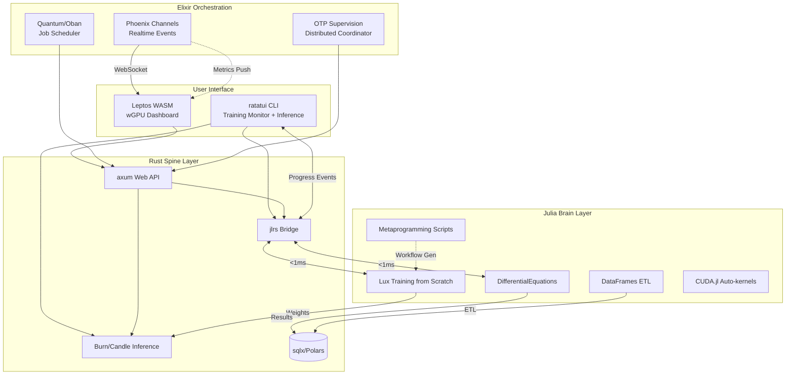
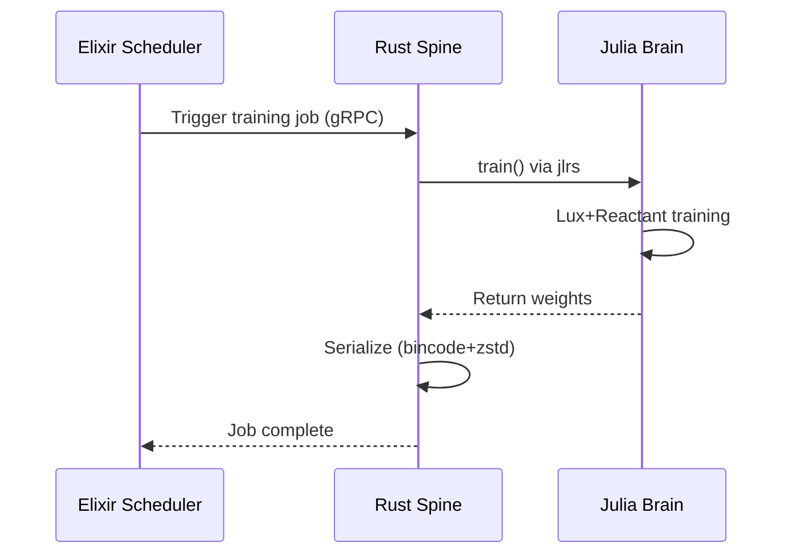
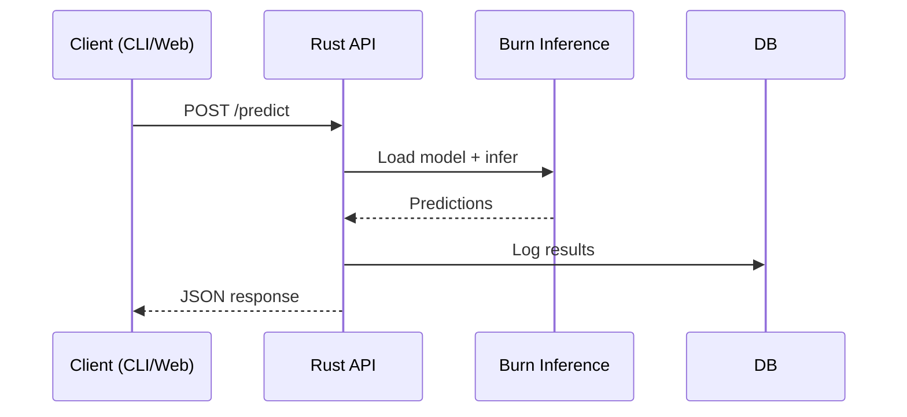
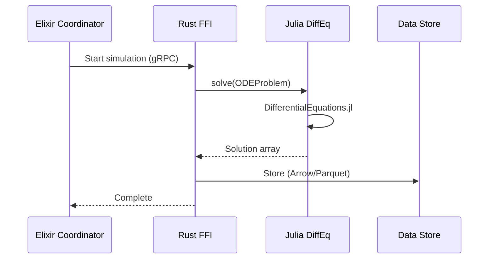

# Multi-Language Architecture Specification

> **Note**: For rationale and detailed comparisons, see [rationale.md](rationale.md)

## Role Separation

| Layer | Language | Core Strength | Primary Use Case |
|-------|----------|---------------|------------------|
| Brain | Julia | Multiple dispatch + Type-stable JIT + Auto-GPU fusion | DL training, ODE/PDE, scripting, data exploration |
| Spine | Rust | Ownership + Zero-cost abstractions + Fearless concurrency | API, inference, CLI, FFI, Web (WASM+wGPU) |
| Orchestration | Elixir | Actor model + OTP supervision | Scheduling, distributed, realtime, fault tolerance |

## Folder Structure

```
machine_learning/
├── lang/                           # Language-specific implementations
│   ├── julia/                      # Brain: Training/simulation/scripting (DiffEq, CUDA, DataFrames)
│   ├── rust/                       # Spine: API/inference/CLI/Web (axum, Burn, ratatui, Leptos, wgpu)
│   └── elixir/                     # Orchestration: Scheduling/distributed (OTP, Phoenix Channels)
├── shared/                         # Cross-language contracts (.proto, .json)
├── tests/                          # Integration tests (FFI, E2E)
├── benchmarks/                     # Performance comparisons
├── scripts/                        # Build/deployment (Docker, K8s)
├── docs/                           # Local-only (git-ignored)
├── docs-en/                        # Public English docs
├── docs-jp/                        # Public Japanese docs
├── .github/workflows/              # CI/CD
├── .gitignore
├── .jj/                            # Jujutsu VCS
├── LICENSE-MIT
├── LICENSE-APACHE
└── README.md
```

**Internal structure per language**:
- Julia: `Project.toml` + `src/MLCore.jl` (module wrapper)
- Rust: `Cargo.toml` workspace + flat crates (`api/`, `inference/`, `cli/`, `web/`, `ffi_julia/`)
- Elixir: OTP application structure (flat modules at root)

## Language-Specific Conventions

### Julia (`lang/julia/`)
- Module-first: `src/MLCore.jl` wraps all files via `include()`
- Tests: `test/runtests.jl` for exported API only
- Deploy: PackageCompiler sysimage
- GPU: CUDA.jl auto-kernels, AcceleratedKernels.jl for cross-platform

### Rust (`lang/rust/`)
- Flat workspace: Crates at root (`api/`, `inference/`, `cli/`, `web/`, `ffi_julia/`)
- CLI stack: `clap` (args) + `ratatui` (TUI) + `indicatif` (progress) + `tracing` (logs)
- Web stack: `Leptos` (WASM) + `wgpu` (WebGPU) + `egui` (charts)
- Boundary: `lib.rs` only, tests in `tests/integration.rs`
- Max 2 levels: workspace → crate → file

### Elixir (`lang/elixir/`)
- Flat: OTP modules at root (no `lib/` subdirectory)
- Scheduling: Quantum (cron) / Oban (persistent jobs)
- Distributed: Node連携, Phoenix Channels (realtime → Rust WASM)
- Stream: Broadway/GenStage (backpressure)

## Library Stack

### Julia (10 libs)

| Category | Library | Purpose |
|----------|---------|---------|
| **DL** | Lux.jl + Reactant.jl | Training (MLIR/XLA, Enzyme内包) |
| **GPU** | KernelAbstractions.jl | Vendor-neutral kernels |
| **GPU Algos** | AcceleratedKernels.jl | sort/reduce/scan (AMD公式) |
| **CPU Parallel** | OhMyThreads.jl | `@tasks` マクロ (LV代替推奨) |
| **CPU Low-level** | Polyester.jl | `@batch` 低オーバーヘッド |
| **Tensor** | Tullio.jl | Einstein notation + 自動GPU |
| **ODE/PDE** | DifferentialEquations.jl | Solvers (50-1000x faster) |
| **Data** | Arrow.jl + DataFrames.jl | Zero-copy ETL |
| **FFI** | jlrs | Rust interop (<1ms) |
| **Profile** | BenchmarkTools.jl | `@btime` / `@benchmark` |

### Rust (10 libs)

| Category | Library | Purpose |
|----------|---------|---------|
| **Inference** | Burn | Pure Rust DL (ONNX/WASM) |
| **GPU** | wgpu | WebGPU (Vulkan/Metal/DX12/WebGL) |
| **Parallel** | rayon | Data parallelism (work-stealing) |
| **SIMD** | pulp | Runtime dispatch (faer実績) |
| **SIMD** | wide | 固定幅 SIMD (NEON/WASM/x86) |
| **Serialize** | rkyv + zstd | Zero-copy + compression |
| **Web** | Leptos + egui | WASM UI + charts |
| **API** | axum + tonic | HTTP + gRPC |
| **FFI** | jlrs | Julia interop |
| **Log** | tracing | Structured logging |

### Elixir (5 libs)

| Category | Library | Purpose |
|----------|---------|---------|
| **Jobs** | Oban | Queue + cron + retries |
| **Cluster** | libcluster + Horde | Auto-discovery + registry |
| **gRPC** | grpc-elixir | Rust communication |
| **Realtime** | Phoenix Channels | WebSocket + PubSub |
| **Monitor** | LiveDashboard + Telemetry | Metrics UI |

## Architecture Diagram



## Data Flow Patterns

### Training Pipeline


### Inference Pipeline


### Simulation Pipeline


## FFI Boundaries

| Boundary | Direction | Protocol | Latency Target |
|----------|-----------|----------|----------------|
| Rust ↔ Julia | Bidirectional | jlrs 0.22 | <1ms |
| Rust ↔ Elixir | API | gRPC (tonic ↔ grpc-elixir) | <10ms |
| Rust ↔ Web (WASM) | Same binary | wasm-bindgen | <1ms |
| Elixir → Web | Push | Phoenix Channels (WebSocket) | <50ms |
| CLI ↔ Julia | Event stream | jlrs 0.22 (progress events) | <1ms |

## jlrs 0.22 FFI Implementation

### Overview

| Property | Value |
|----------|-------|
| Version | 0.22.x |
| Julia Support | 1.10, 1.11, 1.12 (LTS) |
| Rust Requirement | 1.85+ (2024 edition) |
| Latency Target | <1ms per call |
| Zero-Copy API | `inline_data()` |

### Breaking Changes (0.21 → 0.22)

| Category | 0.21 | 0.22 |
|----------|------|------|
| Function calls | `call0/1/2/3` | `call(&[args])` |
| Keyword args | `ProvideKeywords` | `named_tuple!` macro |
| Runtime | sync runtime | `LocalHandle` only |
| Environment | `JULIA_DIR` | `JLRS_JULIA_DIR` |
| Type refs | `ManagedRef` | `ManagedWeak` |

### Zero-Copy Strategies

| Method | Use Case | Performance |
|--------|----------|-------------|
| `inline_data()` | Direct slice access (`&[T]`) | Fastest (μs) |
| `jlrs-ndarray` | ndarray integration | Fast (mutable views) |
| `copy_inline_data()` | Ownership transfer | Copy overhead |

**Constraints:**
- Inline storage types only (Float32, Int64)
- No boxed types (Any, Union)

### Async Integration

| Feature | Description |
|---------|-------------|
| Runtime | Tokio (`tokio-rt` feature) |
| BlockingTask | CPU-intensive (holds GIL) |
| AsyncTask | IO-waiting (concurrent) |
| PersistentTask | Long-running (gc_safe) |

### Performance Optimization

| Technique | Impact |
|-----------|--------|
| LTO (`lto` feature) | Cross-language optimization |
| Local scope | Stack allocation (fast) |
| `#[gc_safe]` | Allow GC during Rust compute |
| Direct slice access | Zero-copy (fastest) |

**Target:** <1ms per call with local scope + caching

### Migration Checklist

- [ ] Update `jlrs = "0.22"` in Cargo.toml
- [ ] Set `JLRS_JULIA_DIR` environment variable
- [ ] Replace `call0/1/2/3` → `call`
- [ ] Use `named_tuple!` for keyword arguments
- [ ] Update async code (remove `async_trait`)
- [ ] Test FFI boundaries only

### Resources

- [docs.rs/jlrs](https://docs.rs/jlrs/latest/jlrs/)
- [jlrs-tutorial](https://taaitaaiger.github.io/jlrs-tutorial/)
- [GitHub/examples](https://github.com/Taaitaaiger/jlrs/tree/master/examples)

## Component Ownership

| Component | Owner | Technology |
|-----------|-------|------------|
| DL Training | Julia | Lux+Reactant (MLIR/XLA) |
| ODE/PDE Simulation | Julia | DifferentialEquations.jl |
| Scripting & Automation | Julia | Metaprogramming (@macro, @generated) |
| Data Exploration | Julia | DataFrames + Makie + Pluto |
| Parallel ETL | Julia | DataFrames.jl |
| GPU Kernels | Julia | CUDA.jl + AcceleratedKernels.jl |
| Production Inference | Rust | Burn/Candle |
| Web API | Rust | axum+tokio |
| FFI Hub | Rust | jlrs |
| CLI Training Monitor | Rust | ratatui + indicatif + tracing |
| CLI Interactive Inference | Rust | ratatui (chat-like TUI) |
| Web Dashboard | Rust | Leptos (WASM) + wgpu + egui |
| Job Scheduler | Elixir | Quantum (cron) / Oban (persistent) |
| Multi-node Cluster | Elixir | OTP supervision |
| Realtime Events | Elixir | Phoenix Channels |
| Stream Processing | Elixir | Broadway/GenStage |

## Shared Contracts

- `.proto`: gRPC schemas for Rust ↔ Elixir
- `.json`: JSON schemas for Rust API (OpenAPI)

## Testing Strategy

**Test fragile joints ONLY. Internal bugs = type system's job.**

**What to test** (fragile seams):
- FFI boundaries (Rust ↔ Julia, Rust ↔ Zig)
- Cross-language contracts (`shared/` schema compliance)
- Module boundaries (exported API, `lib.rs`, `MLCore.jl`)
- Data format serialization/deserialization

**What NOT to test** (internal implementation):
- Private functions, implementation details
- Pure logic (type system enforces correctness)
- Helper functions within modules

**Rationale**: Tests for joints that break. Types for logic that's wrong. Refactor freedom > test coverage.

## GPU Processing

| Operation | Julia Mechanism | Auto-Generation |
|-----------|-----------------|-----------------|
| Array ops | `A .= B .+ C` | Broadcast → fused kernel |
| Data transfer | `cu(array)` | Host→Device copy |
| Custom kernels | `@cuda` macro | Explicit launch |
| Cross-platform | AcceleratedKernels.jl | CUDA/ROCm/oneAPI |
| Deep Learning | Lux+Reactant | MLIR/XLA compiler |

## Build System

| Language | Tool | Config | Incremental |
|----------|------|--------|-------------|
| Julia | Pkg.jl | `Project.toml` | ✅ |
| Rust | Cargo | `Cargo.toml` | ✅ |
| Rust (WASM) | wasm-pack | `Cargo.toml` | ✅ |
| Elixir | Mix | `mix.exs` | ✅ |

### Cross-Language Orchestration

| Team Size | Priority | Recommendation |
|-----------|----------|----------------|
| 1-3 | Dev speed | **Task** (Taskfile.yml) |
| 4-10 | CI/CD | **Bazel** (hermetic builds) |
| 10+ | Scale | **Bazel** (mandatory) |

## Deployment

| Language | Output | Size | Method |
|----------|--------|------|--------|
| Julia | `MLCore.so` (sysimage) | <500MB | GPU node (vertical) |
| Rust | `ml-api` (static binary) | <50MB | Container (horizontal) |
| Rust | `ml-cli` (static binary) | <15MB | Direct install |
| Rust | `ml-web.wasm` (WASM bundle) | <10MB | CDN |
| Elixir | BEAM release | <100MB | Container (OTP) |

## Migration Path

1. Create `lang/{julia,rust,elixir}`
2. Flatten existing code during move (remove `crates/`, `src/` wrappers)
3. Establish `shared/` for schemas (flat, no subdirectories)
4. Reorganize tests to flat structure
5. Migrate Python scripts to Julia metaprogramming

## Development Workflow

1. Define `shared/tensor.proto` (binary format for all languages)
2. Implement `lang/rust/ffi_julia/` bridge (zero-copy roundtrip)
3. Pass `tests/rust_julia_ffi.rs` (architecture validated)
4. Expand incrementally (training → serialize → inference → E2E test)

**Anti-pattern**: Parallel development without integration. Establish FFI first.

## Common Pitfalls

1. **Root `Cargo.toml`**: Delete it. Keep Rust isolated in `lang/rust/`, invoke via `scripts/`
2. **`shared/` integration**: Use codegen (Rust: build-time via prost, Julia: runtime, Elixir: protobuf-elixir)
3. **Docker context**: Build from root to access both `shared/` and `lang/`
4. **WASM build**: Separate `web/` crate with `wasm-pack`, avoid jlrs in WASM target

## Design Invariants

1. **Single Source of Truth**: Models trained in Julia, deployed from Rust
2. **Boundary Minimization**: 3 languages, 2 FFI boundaries (Rust↔Julia, Rust↔Elixir)
3. **Language Isolation**: Each language accesses only designated resources
4. **Type Safety**: Newtype wrappers at all FFI boundaries
5. **Observable**: Structured logging at all layer transitions
6. **No Redundancy**: Each language has non-overlapping primary use case
7. **No Legacy Dependencies**: Build DL from scratch in Julia
8. **CLI as First-class**: Training/inference UX at parity with Web UI
9. **Rust Unification**: CLI + API + Web (WASM) in single language

## Key Constraints

| Constraint | Enforcement | Rationale |
|------------|-------------|-----------|
| No root `Cargo.toml` | Project root | Isolate Rust |
| `shared/` as sole source | Build scripts | Prevent drift |
| Docker from root | `scripts/` docs | Access all dirs |
| FFI tests first | Required | Validate arch |
| Flat structure | Max 2 levels | Reduce overhead |

## Language Summary

| # | Language | Primary Role | Priority |
|---|----------|--------------|----------|
| 1 | Julia | Training/Simulation/Scripting/Data/GPU | Core |
| 2 | Rust | Inference/API/CLI/Web(WASM)/FFI | Core |
| 3 | Elixir | Scheduling/Distributed/Realtime | Core |

## Future Extensions (Conditional)

| Language | Trigger Condition | Use Case |
|----------|-------------------|----------|
| OCaml | 規制産業展開 (金融/医療/自動運転) | 形式検証層 (Coq連携) |
| Scala | 既存JVM資産統合 | Spark/Kafka/Hadoop |
| Zig | 極限のSIMD最適化要求 | カスタムカーネル (Rustで不足時) |

## CLI Features

### Training Monitor (`ml-cli train monitor`)
- Real-time loss/metrics visualization (sparklines, gauges)
- Progress bars with ETA
- GPU utilization overlay
- Event stream from Julia via jlrs (<1ms latency)
- Structured logs (tracing subscriber)

### Interactive Inference (`ml-cli infer`)
- Chat-like TUI (OpenCodeCLI-style)
- Model selection prompt
- Input history with arrow navigation
- Streaming token generation display
- Result export (JSON/CSV)
