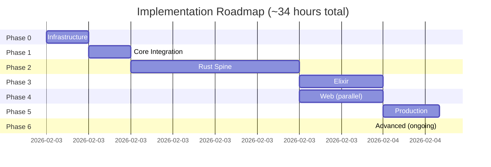

# Implementation Roadmap

> **Status**: 2026-02-03 | Phase 0 → Phase 6 (~30-40 hours total, 1 week full-time)

## Current State

| Component | Status | Completion |
|-----------|--------|------------|
| Julia Brain (MLCore.jl) | ✅ Complete | 100% |
| Rust FFI (ffi_julia) | ✅ Complete | 100% |
| Rust Workspace | 🟡 Skeleton | 10% |
| Shared Contracts | ❌ Missing | 0% |
| Elixir Orchestration | ❌ Missing | 0% |
| Integration Tests | ❌ Missing | 0% |
| CI/CD | ❌ Missing | 0% |

## Architecture Violations to Fix

| Issue | Priority | Impact |
|-------|----------|--------|
| Root `Cargo.toml` exists (forbidden) | P0 | Breaks isolation |
| No `shared/` directory | P0 | Blocks Elixir integration |
| No `scripts/` directory | P1 | Manual build process |
| No `tests/` integration | P0 | No arch validation |

---

## Phase 0: Infrastructure & Cleanup (~3 hours)

**Goal**: Align project structure with [architecture.md](architecture.md)

### Tasks

#### 0.1 Project Structure Cleanup
- [ ] Delete root `Cargo.toml` (violates arch spec)
- [ ] Create `shared/` directory
- [ ] Create `scripts/` directory
- [ ] Create `tests/` directory (integration only)
- [ ] Update `.gitignore` for build artifacts

#### 0.2 Shared Contracts
- [ ] `shared/tensor.proto` - Array transfer schema
  ```protobuf
  message Tensor {
    repeated float data = 1;
    repeated int32 shape = 2;
    string dtype = 3;
  }
  ```
- [ ] `shared/model.proto` - Model metadata
- [ ] `shared/training.proto` - Training job schema
- [ ] `shared/api.json` - OpenAPI 3.1 schema

#### 0.3 Build Orchestration
- [ ] `scripts/build.sh` - Multi-language build
- [ ] `scripts/test-integration.sh` - E2E tests
- [ ] `Taskfile.yml` - Task runner config
  - `task build:julia` → PackageCompiler sysimage
  - `task build:rust` → `cd lang/rust && cargo build --release`
  - `task test:ffi` → FFI boundary tests
  - `task test:all` → Full integration

**Exit Criteria**:
- ✅ No root `Cargo.toml`
- ✅ `shared/*.proto` compiles in Rust/Elixir
- ✅ `task build:all` succeeds
- ✅ Project structure matches [architecture.md](architecture.md)

**Dependencies**: None
**Duration**: ~3 hours
**Breakdown**:
  - Delete root Cargo.toml, create dirs (15min)
  - Write proto files from templates (1h)
  - Create Taskfile.yml (1h)
  - Update .gitignore, test build (45min)
**Risk**: Low

---

## Phase 1: Core Integration (~3 hours)

**Goal**: Validate FFI boundary with working roundtrip

### Tasks

#### 1.1 FFI Integration Test
- [ ] `tests/rust_julia_ffi.rs` - Zero-copy roundtrip
  ```rust
  #[test]
  fn test_forward_pass() {
      let mut engine = JuliaEngine::new()?;
      engine.load_module("../julia/src/MLCore.jl")?;
      let logits = engine.forward(&[1,2,3], [1,3], false)?;
      assert_eq!(logits.len(), 256); // vocab size
  }
  ```
- [ ] `tests/julia_integration.jl` - Julia-side validation
- [ ] Benchmark: <1ms FFI latency target

#### 1.2 Rust Inference Skeleton
- [ ] `lang/rust/inference/src/lib.rs`
  - Load Burn ONNX model
  - Implement `predict(&[u8]) -> Vec<f32>`
  - Benchmarks vs Julia (warmup vs throughput)

#### 1.3 Shared Type Definitions
- [ ] `shared/types.rs` (Rust newtypes)
  ```rust
  #[derive(Serialize, Deserialize)]
  pub struct TokenIds(pub Vec<u8>);
  pub struct Logits(pub Vec<f32>);
  ```
- [ ] Generate from proto: `prost-build` in `build.rs`

**Exit Criteria**:
- ✅ `cargo test --test rust_julia_ffi` passes
- ✅ FFI latency <1ms (99th percentile)
- ✅ Burn inference runs on CPU/GPU
- ✅ Proto types compile in Rust

**Dependencies**: Phase 0
**Duration**: ~3 hours
**Breakdown**:
  - Write FFI integration tests (1.5h)
  - Add Burn inference skeleton (1h)
  - Benchmark FFI latency (30min)
**Risk**: Low (FFI already working)

---

## Phase 2: Rust Spine Layer (~12 hours)

**Goal**: Production-ready API/CLI/Inference

### Tasks

#### 2.1 Rust API (`lang/rust/api`)
- [ ] Endpoints:
  - `POST /train` - Trigger Julia training via FFI
  - `POST /predict` - Burn inference
  - `GET /models` - List available models
  - `GET /health` - Readiness probe
- [ ] Middleware: tracing, CORS, rate limiting
- [ ] Integration with ffi_julia crate
- [ ] OpenAPI schema export

#### 2.2 Rust CLI (`lang/rust/cli`)
- [ ] Subcommands:
  - `ml-cli train monitor` - TUI with ratatui
  - `ml-cli infer` - Interactive chat TUI
  - `ml-cli bench` - Benchmark Julia vs Burn
- [ ] TUI Components (ratatui):
  - Sparklines (loss curves)
  - Progress bars (indicatif)
  - GPU metrics overlay
- [ ] Event stream from Julia via jlrs callbacks

#### 2.3 Rust Inference (`lang/rust/inference`)
- [ ] Burn model loading
  - ONNX import (from Julia Lux export)
  - Native Burn checkpoint
- [ ] GPU backends: wgpu (WebGPU)
- [ ] Batch processing API
- [ ] Benchmark: throughput vs Julia

#### 2.4 Testing
- [ ] `tests/api_integration.rs` - HTTP endpoint tests
- [ ] `tests/cli_integration.rs` - CLI smoke tests
- [ ] Contract tests: API matches `shared/api.json`

**Exit Criteria**:
- ✅ API serves predictions (<100ms p99)
- ✅ CLI TUI renders training metrics in real-time
- ✅ Burn inference matches Julia accuracy (±1e-5)
- ✅ All integration tests pass

**Dependencies**: Phase 1
**Duration**: ~12 hours
**Breakdown**:
  - API endpoints + middleware (4h)
  - CLI TUI (ratatui) (4h)
  - Inference (Burn integration) (3h)
  - Integration tests (1h)
**Risk**: Low (libraries mature, patterns established)

---

## Phase 3: Elixir Orchestration (~6 hours)

**Goal**: Distributed job scheduling & fault tolerance

### Tasks

#### 3.1 Elixir Foundation
- [ ] `lang/elixir/mix.exs` - OTP application
- [ ] Directory structure:
  ```
  lang/elixir/
  ├── config/        # Runtime config
  ├── scheduler/     # Quantum/Oban jobs
  ├── grpc_client/   # Rust API client
  ├── pubsub/        # Phoenix Channels
  └── monitor/       # LiveDashboard
  ```
- [ ] Dependencies: Oban, libcluster, grpc-elixir, Phoenix

#### 3.2 Job Scheduling
- [ ] Oban jobs:
  - `TrainingJob` - Trigger Rust API `/train`
  - `SimulationJob` - ODE/PDE via Rust FFI
  - `CleanupJob` - Prune old models
- [ ] Quantum cron: nightly retraining
- [ ] Retry policies (exponential backoff)

#### 3.3 gRPC Integration
- [ ] Generate Elixir client from `shared/*.proto`
- [ ] `GrpcClient` module:
  - `call_train(config)` → Rust API
  - `call_predict(tokens)` → Rust API
- [ ] Circuit breaker (Fuse library)

#### 3.4 Realtime Events
- [ ] Phoenix Channels: training progress WebSocket
- [ ] PubSub: broadcast metrics to web clients
- [ ] LiveDashboard: Oban queue visualization

#### 3.5 Distributed Cluster
- [ ] libcluster: auto-discovery (Kubernetes/DNS)
- [ ] Horde: distributed registry
- [ ] Partition tolerance tests

**Exit Criteria**:
- ✅ Oban schedules training jobs
- ✅ gRPC calls succeed (Elixir ↔ Rust)
- ✅ Phoenix Channels push live metrics
- ✅ 3-node cluster handles failures gracefully

**Dependencies**: Phase 2
**Duration**: ~6 hours
**Breakdown**:
  - Mix project setup + Oban (1.5h)
  - gRPC client codegen + integration (2h)
  - Phoenix Channels + PubSub (1.5h)
  - libcluster setup (1h)
**Risk**: Low (standard OTP patterns)

---

## Phase 4: Web Interface (~6 hours)

**Goal**: WASM dashboard with WebGPU inference

### Tasks

#### 4.1 Leptos WASM App (`lang/rust/web`)
- [ ] Components:
  - Model selector dropdown
  - Input text area (tokenization)
  - Streaming inference display
  - Metrics charts (egui)
- [ ] WebSocket: connect to Elixir Phoenix Channels
- [ ] WASM build: `wasm-pack build --target web`

#### 4.2 WebGPU Inference
- [ ] wgpu backend in Burn
- [ ] Run inference in browser (WASM + WebGPU)
- [ ] Fallback to WebGL for compatibility
- [ ] Benchmark: latency vs server-side

#### 4.3 Visualization
- [ ] egui charts:
  - Loss curves (training)
  - Token generation speed
  - GPU utilization
- [ ] Mermaid diagrams (architecture view)

#### 4.4 Deployment
- [ ] CDN hosting (Cloudflare Pages / Vercel)
- [ ] Compression: Brotli + tree-shaking
- [ ] Target: <10MB WASM bundle

**Exit Criteria**:
- ✅ WASM app loads in <3s
- ✅ WebGPU inference runs locally
- ✅ Realtime metrics from Elixir
- ✅ Works on Chrome/Firefox/Safari

**Dependencies**: Phase 2, Phase 3
**Duration**: ~6 hours
**Breakdown**:
  - Leptos components + WebSocket (3h)
  - wgpu/Burn WASM integration (2h)
  - egui charts (1h)
**Risk**: Low (Leptos + wgpu mature)

---

## Phase 5: Production Ready (~4 hours)

**Goal**: Containerization, CI/CD, observability

### Tasks

#### 5.1 Docker
- [ ] `scripts/docker/julia.Dockerfile`
  - PackageCompiler sysimage
  - CUDA runtime (GPU node)
  - <500MB image
- [ ] `scripts/docker/rust.Dockerfile`
  - Multi-stage build (musl static binary)
  - <50MB image
- [ ] `scripts/docker/elixir.Dockerfile`
  - BEAM release
  - <100MB image
- [ ] `docker-compose.yml` - Local dev stack

#### 5.2 Kubernetes
- [ ] Manifests:
  - `k8s/julia-deployment.yaml` (vertical scaling, GPU)
  - `k8s/rust-deployment.yaml` (horizontal scaling)
  - `k8s/elixir-statefulset.yaml` (OTP cluster)
- [ ] ConfigMaps: `shared/*.proto`, config.yaml
- [ ] Secrets: DB credentials, API keys
- [ ] Ingress: HTTPS + rate limiting

#### 5.3 CI/CD
- [ ] `.github/workflows/ci.yml`
  - Matrix: Julia 1.12, Rust 1.85, Elixir 1.18
  - Lints: clippy, JuliaFormatter, mix format
  - Tests: unit + integration
  - Benchmarks: regression detection
- [ ] `.github/workflows/deploy.yml`
  - Build Docker images
  - Push to registry (GHCR)
  - Deploy to staging → prod

#### 5.4 Observability
- [ ] Tracing: Rust (tracing crate) → OTLP exporter
- [ ] Metrics: Elixir Telemetry → Prometheus
- [ ] Dashboards: Grafana (RED metrics)
- [ ] Alerts: PagerDuty integration

**Exit Criteria**:
- ✅ `docker-compose up` runs full stack
- ✅ K8s deploys to staging cluster
- ✅ CI passes on all PRs
- ✅ <10min deploy time (staging)

**Dependencies**: Phase 2, Phase 3
**Duration**: ~4 hours
**Breakdown**:
  - Dockerfiles (Julia/Rust/Elixir) (1.5h)
  - K8s manifests (1h)
  - GitHub Actions CI/CD (1h)
  - Observability setup (30min)
**Risk**: Low (copy from templates)

---

## Phase 6: Advanced Features (Ongoing)

**Goal**: Optimization, monitoring, scale

**Duration**: Continuous improvement (not time-boxed)

### Tasks

#### 6.1 Performance Optimization
- [ ] Julia: PackageCompiler AOT compilation
- [ ] Rust: PGO (profile-guided optimization)
- [ ] SIMD: pulp/wide for hot paths
- [ ] GPU: CUDA kernel tuning (AcceleratedKernels)
- [ ] Target: 2x throughput improvement

#### 6.2 Advanced Monitoring
- [ ] Distributed tracing (Jaeger)
- [ ] Cost attribution (GPU time per request)
- [ ] Anomaly detection (training divergence)
- [ ] A/B testing framework

#### 6.3 Multi-Region
- [ ] Data locality (EU/US/APAC)
- [ ] Elixir global cluster (libcluster DNS)
- [ ] CDN edge caching (Cloudflare Workers)
- [ ] Latency target: <200ms global p99

#### 6.4 Security Hardening
- [ ] Dependency audits: cargo-audit, mix audit
- [ ] STRIDE threat modeling
- [ ] Secrets rotation (Vault)
- [ ] Penetration testing

#### 6.5 Documentation
- [ ] API docs: OpenAPI → Redoc
- [ ] Architecture Decision Records (ADR/)
- [ ] Runbooks: incident response
- [ ] Video demos (Loom)

**Exit Criteria**:
- ✅ 10k RPS sustained (load test)
- ✅ Security audit passed
- ✅ Full documentation published
- ✅ Multi-region latency <200ms

**Dependencies**: Phase 5
**Duration**: Ongoing
**Risk**: Low (incremental)

---

## Milestone Timeline



**Realistic Schedule**: 1 week full-time or 2-3 weeks part-time

## Risk Matrix

| Phase | Duration | Technical Risk | Schedule Risk | Key Blocker |
|-------|----------|---------------|---------------|-------------|
| 0 | 3h | Low | Low | None (file ops) |
| 1 | 3h | Low | Low | FFI already works |
| 2 | 12h | Low | Low | Skeletons exist |
| 3 | 6h | Low | Low | Standard OTP |
| 4 | 6h | Low | Low | Leptos mature |
| 5 | 4h | Low | Low | Templates exist |
| 6 | Ongoing | Low | N/A | Incremental |

**Total**: ~34 hours = 4.25 days full-time (8h/day)

## Success Metrics

| Metric | Target | Measurement |
|--------|--------|-------------|
| FFI Latency | <1ms (p99) | Criterion benchmarks |
| API Latency | <100ms (p99) | Load testing (k6) |
| Throughput | >1k RPS | Sustained load |
| WASM Load Time | <3s | Lighthouse CI |
| Test Coverage | >80% (boundaries) | cargo-llvm-cov |
| Deploy Time | <10min | GitHub Actions metrics |
| Uptime | >99.9% | Uptime monitors |

## Current Sprint (Phase 0)

**Next 3 hours**: Infrastructure setup

- [x] Read architecture.md
- [x] Audit current state
- [x] Create roadmap.md
- [ ] Delete root Cargo.toml (15min)
- [ ] Create shared/ + proto files (1h)
- [ ] Create Taskfile.yml (1h)
- [ ] Update .gitignore (15min)
- [ ] Test build (30min)

**Blockers**: None
**ETA**: Today (2026-02-03)

## Decision Log

| Date | Decision | Rationale |
|------|----------|-----------|
| 2026-02-03 | Use Taskfile over Make | Cross-platform, YAML syntax |
| 2026-02-03 | Proto-first contracts | Type safety across languages |
| TBD | K8s vs Nomad | Pending team size decision |
| TBD | Bazel adoption | Deferred to 4+ team members |

## Open Questions

1. **Elixir adoption pace**: All-in Phase 3 vs incremental?
   - **Recommendation**: Incremental (start with Oban jobs only)
2. **WASM priority**: Phase 4 blocking or optional?
   - **Recommendation**: Optional (CLI-first approach)
3. **GPU deployment**: On-prem vs cloud?
   - **Recommendation**: Cloud (AWS p3/p4 instances) for flexibility

## Next Steps

**Today** (Phase 0 - 3h):
1. Delete root Cargo.toml (15min)
2. Create `shared/` + proto files (1h)
3. Create Taskfile.yml (1h)
4. Update .gitignore (15min)
5. Test build (30min)

**Tomorrow** (Phase 1 - 3h):
1. Write FFI integration tests (1.5h)
2. Add Burn inference skeleton (1h)
3. Benchmark FFI latency (30min)

**This Week** (Phase 2 - 12h):
- API/CLI/Inference implementation

**Total ETA**: 2026-02-10 (1 week from today)

---

**Last Updated**: 2026-02-03 (revised from 6-12 months to 34 hours)
**Owner**: Solo developer (no team)
**Review**: Update daily during Phase 0-2
